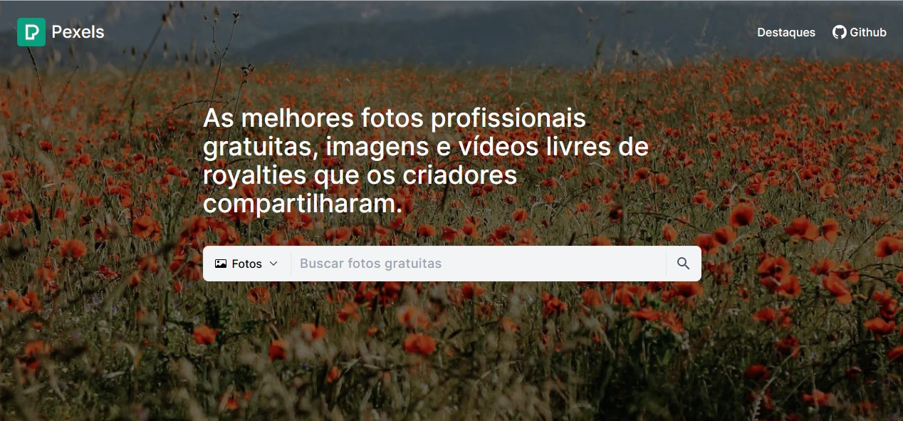
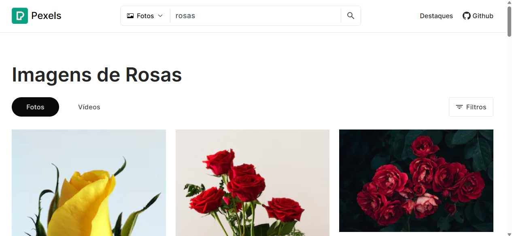
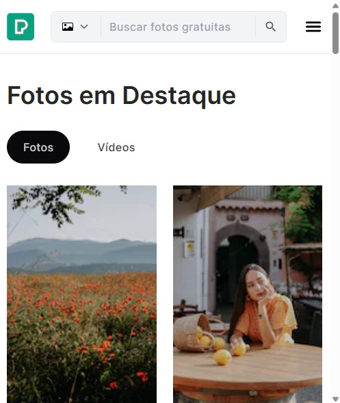

# Search Pexels

Um clone simplificado do site do [Pexels](https://www.pexels.com/pt-br/), onde você pode buscar por imagens e vídeos, fazer download de imagens e filtrar por orientação e cor. Todo o conteúdo vem da [API do Pexels](https://www.pexels.com/pt-br/api/).

## 🌠 Demo

<a target="_blank" href="https://search-pexels.vercel.app/">https://search-pexels.vercel.app/</a>








## 🛠 Tecnologias usadas

-   [Nextjs + React](https://nextjs.org/)
-   [TypeScript](https://www.typescriptlang.org/pt/)
-   [TailwindCss](https://tailwindcss.com/)


## 💻 Primeiros passos
Antes de começar, voce precisa ter o [Git](https://git-scm.com) e o [Node.js](https://nodejs.org/en/) instalados na sua máquina.

```bash
# Clonar repositório
$ git clone https://github.com/u-dani/search-pexels.git

# Instalar dependências
$ npm install

# Executar o servidor
$ npm run dev # ou yarn dev
```

Por fim, abra [http://localhost:3000](http://localhost:3000) no navegador para ver o resultado.

